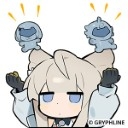
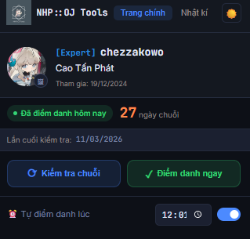
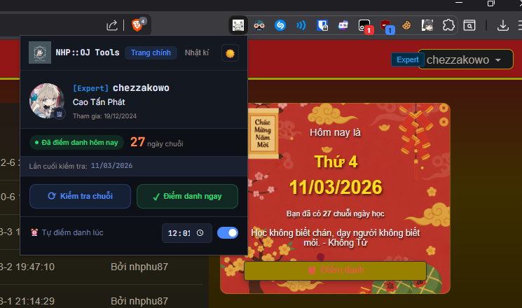
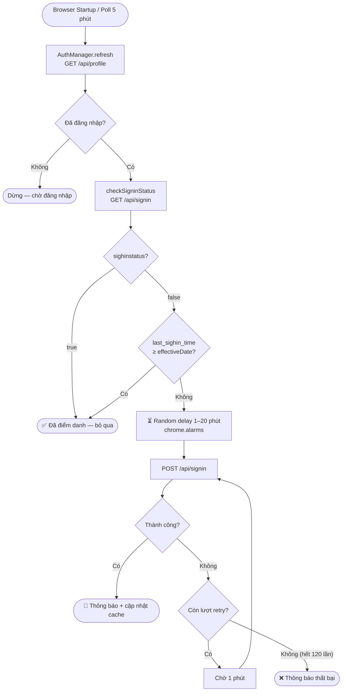

<div align="center">

# NHP::OJ Tools


   

**"Bot" tự động Daily Sign-in cho [NHP::OJ](https://nhpoj.net)**
Mở trình duyệt lên và nó sẽ tự động điểm danh hộ

</div>

---

## ✨ Tính năng

- 🔄 **Tự động điểm danh** hàng ngày theo giờ bạn đặt
- 🕐 **Random delay** 1–20 phút để tránh Mr.P rate limit
- 🔁 **Retry tự động** tối đa 120 lần (2 tiếng) nếu thất bại
- 📊 **Hiển thị thông tin** tài khoản: rank, exp, chuỗi ngày
- 🌙 **Dark / Light mode**
- 📋 **Nhật kí** sign-in và debug log đầy đủ
- ⚡ **Tự kích hoạt khi mở trình duyệt** — không cần mở popup

---

## 🖼️ Ảnh chụp màn hình
Đây là khi mình test trên trình duyệt Brave (v1.87.192)

 

---

## ⚙️ Cách hoạt động

<div align="center">


</div>

> **Lưu ý về múi giờ:** NHP::OJ sử dụng múi giờ `+08:00` với mốc ngày mới lúc `07:00`. Extension tự tính `effectiveDate` đúng theo quy tắc này — người dùng ở Việt Nam (`+07:00`) không cần làm gì thêm.
Thật ra là có ai nước ngoài biết NHP::OJ đâu 🐧

---

## 📦 Cài đặt

> Extension sẽ không bao có trên Chrome Web Store vì đây chỉ là dự án mình làm vì mình lười với mình không muốn tốn 5$ (~140k) cho 1 extension "khá vô dụng" đâu 💔 \


### Yêu cầu
- Google Chrome (hoặc Chromium-based browser)
- Đã có tài khoản trên [NHP::OJ](https://nhpoj.net)

### Các bước

**1. Tải source code**

```bash
git clone https://github.com/chezzakowo/DoMixiNhatRac.git
```

hoặc tải file ZIP từ [Releases](https://github.com/chezzakowo/DoMixiNhatRac/releases) rồi giải nén.

**2. Mở trang Extensions của Chrome**

Truy cập `chrome://extensions/` trên thanh địa chỉ.

**3. Bật Developer Mode**

Bật **Developer mode** ở góc trên bên phải.

**4. Load extension**

Nhấn **Load unpacked** → chọn thư mục `src/` vừa clone/giải nén.

**5. Xong!** 🎉

Icon NHP::OJ Tools sẽ xuất hiện trên thanh công cụ. Đăng nhập vào `nhpoj.net` và mở popup để bắt đầu.

---

## 🛠️ Cài đặt & tuỳ chỉnh

Sau khi cài xong, mở popup và điều chỉnh:

| Tùy chọn | Mô tả | Mặc định |
|---|---|---|
| ⏰ Giờ điểm danh | Giờ kích hoạt alarm hàng ngày | `00:01` |
| 🔄 Tự điểm danh | Bật/tắt tính năng tự động | `Bật` |

> Extension sẽ tự thêm random delay 1–20 phút sau giờ đặt để tránh bị phát hiện là bot.

---

## 🗂️ Cấu trúc thư mục

```
src/
├── background.js     # Service worker — logic chính
├── popup.html        # Giao diện popup
├── popup.js          # Logic popup
├── popup.css         # Style popup (Dark/Light mode)
├── manifest.json     # Manifest v3
└── icons/
    ├── icon16.png
    ├── icon48.png
    └── icon128.png
```

---

## 🤝 Contributors

Cảm ơn tất cả mọi người đã đóng góp cho dự án! 💖

<a href="https://github.com/chezzakowo/DoMixiNhatRac/graphs/contributors">
  
</a>

---

<div align="center">
Made with ❤️ by <a href="https://github.com/chezzakowo">Chez_ </a> & <a href="https://claude.ai">Claude </a>

</div>


